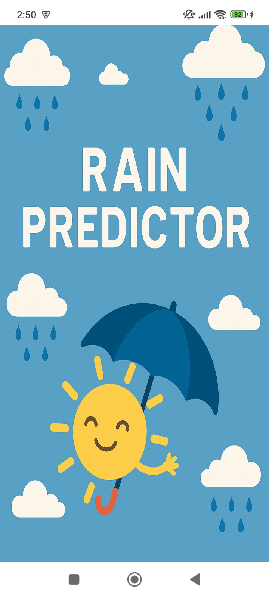
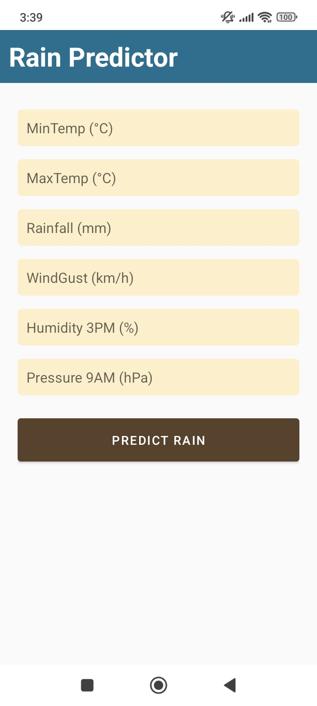
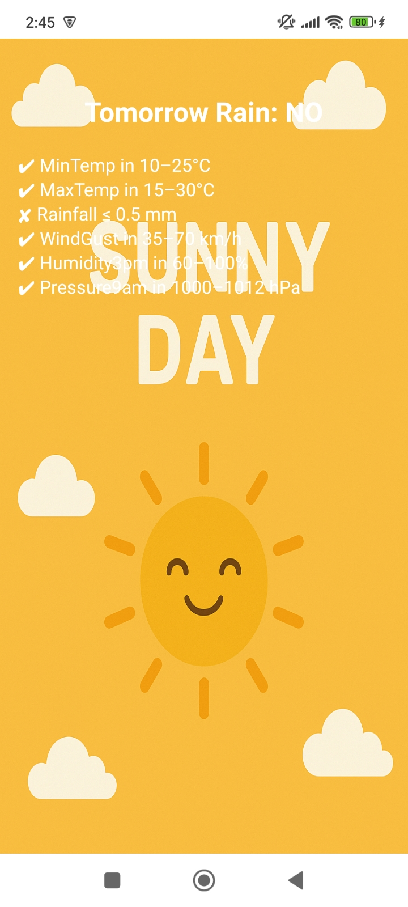
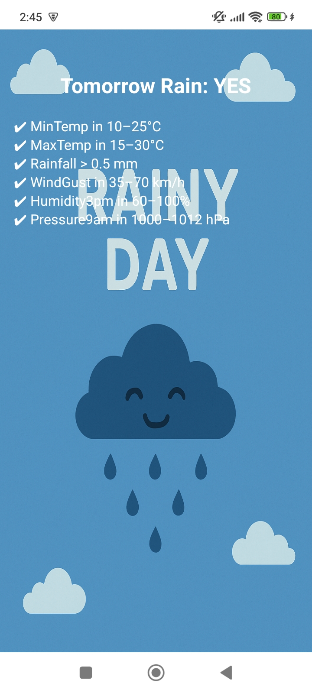

# 🌧️ Rain Predictor

An Android application that predicts weather conditions based on user-input parameters such as temperature, humidity, rainfall, wind speed, and pressure using rule-based logic.

---

## 📱 Overview

Rain Predictor is a mobile application designed to analyze weather-related inputs and provide predictions about possible weather conditions. The app uses predefined validation rules and logical conditions to determine outcomes based on user-provided data.

This project demonstrates real-time input validation and decision-making logic in Android applications.

---

## 🚀 Features

- Weather prediction based on multiple input parameters  
- Input validation with defined ranges  
- Real-time error handling for incorrect inputs  
- Clean and user-friendly interface  
- Instant result display  

---

## 🛠️ Tech Stack

- Kotlin  
- Android SDK  
- XML (UI Design)  
- MVVM Architecture  

---

## 🧠 How It Works

1. User enters weather parameters:
   - Minimum Temperature  
   - Maximum Temperature  
   - Rainfall  
   - Wind Gust  
   - Humidity  
   - Pressure  

2. App validates input ranges  
3. Data is processed using rule-based logic  
4. Weather prediction is generated  
5. Result is displayed on the next screen  

---

## 📸 Screenshots

  
  
  
  

---

## 📌 Input Ranges

| Parameter       | Range            |
|----------------|------------------|
| Min Temp       | 10 – 25 °C       |
| Max Temp       | 15 – 30 °C       |
| Rainfall       | 0.0 – 4.0        |
| Wind Gust      | 35 – 70 km/h     |
| Humidity (3pm) | 60 – 100 %       |
| Pressure (9am) | 1000 – 1012 hPa  |

---

## 🎯 Purpose

This project demonstrates:
- Data validation techniques in Android  
- Rule-based prediction systems  
- Handling user input safely  
- Real-world weather parameter analysis  

---

## ⚙️ Installation

1. Clone the repository  
2. Open in Android Studio  
3. Build the project  
4. Run on emulator or physical device  

---

## 📌 Future Improvements

- Machine Learning-based prediction  
- API integration for real weather data  
- Graph-based visualization  
- Enhanced UI/UX design  
- Historical data tracking  

---

## 💡 Learning Outcome

- Input validation in Android  
- Working with multiple parameters  
- Implementing logical decision systems  
- Activity navigation with data passing  

---

## 👩‍💻 Developer

Azka Shahid  
GitHub: https://github.com/AzkaShahid
